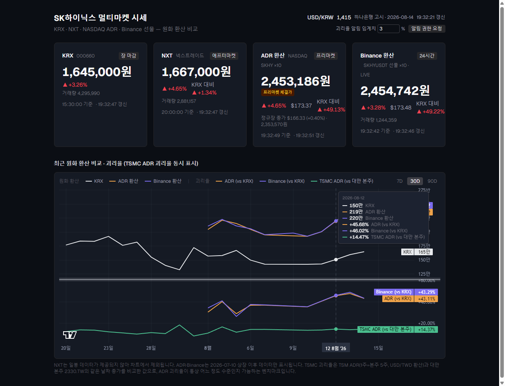

# hynix-monitor

SK하이닉스 가격을 4개 시장에서 모아 원화 기준으로 실시간 비교하는 대시보드.
"지금 어디서 사는 게 제일 싼가"(KRX 대비 괴리율)를 한눈에 보여주는 게 핵심이다.



> 위: 4개 시장 시세 카드(ADR은 `프리마켓 체결가` 뱃지 + 정규장 종가 병기).
> 아래: 원화 환산 비교 차트와 괴리율 서브패널 — SK하이닉스 ADR/Binance 괴리율(+45%대)과
> TSMC ADR 괴리율(+14%대)이 같은 축에서 비교되고, 크로스헤어 툴팁이 전 시리즈 값을 한 번에 보여준다.

- **KRX** 000660 · **NXT**(넥스트레이드) · **NASDAQ ADR** SKHY(×10) · **Binance 선물** SKHYUSDT(×10)
- 환율: 하나은행 고시환율 (주말은 금요일 환율 동결 표시)
- Binance는 WebSocket 틱 실시간, 나머지는 5초(장중)/30초(장외) 폴링
- 7D/30D/90D 토글이 가능한 원화 환산 비교 차트 + 괴리율(%) 서브패널
- 괴리율 서브패널에 **TSMC(2330.TW vs TSM ADR) 괴리율**을 같이 그려 "ADR 괴리율이 통상 어느
  정도인지" 벤치마크로 비교한다
- ADR은 프리/애프터마켓 체결가를 표시하고, 직전 **정규장 종가**를 따로 병기한다
- 괴리율이 설정한 임계치를 넘으면 브라우저 알림

## 아키텍처

```
                        ┌──────────────┐
                        │   브라우저    │
                        │ (SWR 폴링,   │
                        │  WS 직접연결) │
                        └───┬──────┬───┘
                            │      │
              REST(폴링)    │      │  WebSocket(실시간)
                            ▼      ▼
                 ┌─────────────┐  ┌──────────────────┐
                 │ Next.js API │  │ Binance fstream   │
                 │   routes    │  │ (aggTrade, 직접)  │
                 └──────┬──────┘  └──────────────────┘
                        │ 서버 메모리 캐시(TTL) + fetch 타임아웃
        ┌───────┬───────┼───────┬────────┐
        ▼       ▼       ▼       ▼        ▼
     Naver   Naver    Naver   Yahoo   Binance
     (KRX)   (NXT)    (FX)   (ADR·   (선물/일봉)
                             TSMC)
```

- **REST 경로**(KRX·NXT·ADR·FX·30/90일 히스토리)는 Next.js API 라우트가 업스트림을 대신
  호출해 서버 메모리에 TTL 캐싱한다 — 실패 시 만료된 캐시라도 `stale:true`로 돌려줘서
  화면이 완전히 비지 않는다(`lib/server-cache.ts`).
- **Binance 현재가만** 브라우저가 `wss://fstream.binance.com`에 직접 붙는다(REST 폴링보다
  빠른 체결가 반영, 지수 백오프 재연결).
- KRX·NXT는 같은 업스트림 응답(`/api/quote/korean`)을 공유해 클라이언트 왕복을 줄인다.
- 같은 키에 동시에 몰린 캐시 미스는 업스트림 호출 **하나**를 같이 기다린다(`lib/server-cache.ts`)
  — 탭을 여러 개 열어놔도 네이버·Yahoo에 요청이 폭주하지 않는다.
- TSMC 3종(본주·ADR·USD/TWD)은 참고 지표라 실패해도 무시하고 넘어간다 — SK하이닉스 차트는
  그대로 그려진다.

## 화면 구성

- **시세 카드 4개** — 원화 환산가, 등락률(▲▼ 아이콘 포함), KRX 대비 괴리율, 거래량,
  체결시각, 데이터 갱신시각, 장 상태(장중/프리마켓/애프터마켓/장마감/24시간)
- **ADR 시외 가격** — 미국 정규장이 닫힌 뒤에도 프리/애프터 체결가를 그대로 보여주고
  (`애프터마켓 체결가` 뱃지), 그 아래에 직전 정규장 종가를 달러·원화로 병기한다.
  괴리율은 가장 최근 체결가(시외 포함) 기준으로 계산된다.
- **환율 바** — USD/KRW 고시환율, 주말 동결 여부, 갱신시각
- **괴리율 알림** — ADR/Binance 괴리율이 지정한 임계치(기본 ±3%)를 "새로" 넘어설 때만
  브라우저 알림(재알림 스팸 방지), 임계치는 로컬에 저장
- **비교 차트** — 상단: KRX·ADR·Binance 원화 환산가 라인, 하단: 괴리율(%) 서브패널
  (0% 기준선 포함), 7D/30D/90D 기간 토글, 크로스헤어에 전 시리즈 값을 한 번에 보여주는
  통합 툴팁
- **괴리율 서브패널의 TSMC 벤치마크** — SK하이닉스 ADR/Binance 괴리율(vs KRX)과 TSMC ADR
  괴리율(vs 대만 본주)을 같은 축에 겹쳐 그린다. 셋 다 "본국 정규시장 대비 %"라 단위가 같고,
  성숙한 ADR(TSMC)의 괴리율이 어느 대역에서 움직이는지가 비교 기준이 된다.

## 실행

    npm install
    npm run dev        # http://localhost:3000

## 점검

    npm test           # 유닛 테스트 (vitest, lib/ 순수 함수 위주)
    npx tsc --noEmit    # 타입 체크
    npm run lint        # ESLint
    npm run build       # 프로덕션 빌드
    npm run probe       # 업스트림 8종(네이버 시세/일봉/환율, Yahoo ADR·TSMC 2종·USD/TWD,
                        #   Binance) 생존 확인

## 시장 시간 처리

`lib/market-hours.ts`가 시장별 개장 상태를 계산한다 — 폴링 주기(장중 5초/장외 30초)와
카드의 세션 배지에 쓰인다.

| 시장 | 타임존 | 개장 |
|---|---|---|
| KRX | Asia/Seoul | 09:00–15:30 |
| NXT | Asia/Seoul | 프리 08:00–08:50, 정규 09:00–15:20, 애프터 15:30–20:00 |
| NASDAQ ADR | America/New_York | 프리 04:00–09:30, 정규 09:30–16:00, 애프터 16:00–20:00 |
| Binance 선물 | — | 24시간 |
| TSMC 본주(2330.TW) | Asia/Taipei | 09:00–13:30 (차트 전용, 카드 없음) |

## 데이터 원천과 신뢰성

비공식 공개 API(네이버 모바일 증권, Yahoo Finance)와 공식 API(Binance Futures, 하나은행
고시환율)를 함께 쓴다. 비공식 API는 사이트가 스키마를 예고 없이 바꿀 수 있어서:

- 모든 업스트림 fetch에 5초 타임아웃이 걸려 있다(`lib/sources/http.ts`) — 하나가 응답을
  안 줘도 전체 요청이 물고 늘어지지 않는다.
- 서버는 실패 시 마지막 성공 캐시를 `stale:true`로 반환하고, 원인은 서버 콘솔에
  `console.error`로만 남긴다(클라이언트에는 일반화된 메시지).
- 깨진 것 같으면 `npm run probe`로 5개 소스 중 어디가 죽었는지 먼저 확인한다.

## 기술 스택

Next.js 16(App Router) · React 19 · TypeScript · Tailwind CSS 4 · SWR(폴링/캐싱) ·
lightweight-charts(비교 차트, 멀티 페인) · Vitest(유닛 테스트)

## 주의

이 대시보드가 보여주는 괴리율·가격 비교는 정보 제공 목적이며 투자 자문이 아니다.
장외/파생 가격(Binance 선물)은 유동성이 낮아 변동성이 크고, ADR·Binance 환산가는
2026-07-10 상장 이후 데이터만 존재한다(NXT는 일봉 데이터가 제공되지 않아 비교 차트에서
제외된다).

TSMC 괴리율은 대만 본주(2330.TW, 현지 13:30 종가)와 TSM ADR(뉴욕 16:00 종가)의 **같은 날짜**
종가를 비교한 값이다. 두 종가 사이엔 약 14시간의 시차가 있는데, 이는 ADR 괴리율의 통상적인
계산 방식이다. ADR 환산 비율은 종목마다 방향이 반대라는 점에 주의 — SK하이닉스는 ADR 10주가
보통주 1주(×10), TSMC는 ADR 1주가 보통주 5주(÷5)다(`lib/convert.ts`).
